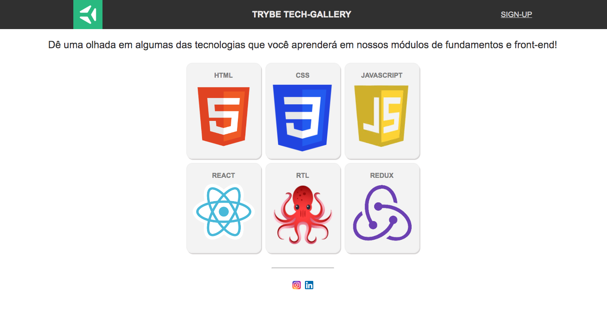

# Tech Gallery

## 💻 Projeto

Desenvolvi uma página web utilizando HTML e CSS com conceitos de Flexbox. A página é uma galeria de fotos com algumas linguagens e frameworks front-end.

O resultado da aplicação pode ser acessado através da seguinte URL: [https://frantend.github.io/tech-gallery](https://frantend.github.io/tech-gallery/)

## 🎨 Layout

📝 Habilidades

Criar uma página web utilizando HTML.
Estilizar a página utilizando conceitos de CSS Flexbox.
Utilizar seletores de classes no CSS.
Utilizar a propriedade justify-content com os valores center, flex-start, flex-end, space-around, space-between, space-evenly
Utilizar a propriedade align-items com os valores stretch, center, flex-start, flex-end, baseline

## Requisitos

1. Criar um cabeçalho utilizando a tag header
O Cabeçalho deve possuir a classe header-container, ser um flex-container e ter 3 elementos filhos: um logotipo com a classe header-img, um título com a classe header-img e um link de login com a classe header-login.

2. Implementar o conteúdo da primeira section
A seção deverá conter no mínimo um elemento de texto que deverá ser posicionado utilizando Flexbox.

3. Implementar o conteúdo da segunda section
A seção deverá conter no mínimo 6 imagens e um título para cada uma delas que deverão ser posicionados utilizando Flexbox.

4. Criar um rodapé utilizando a tag footer
Este rodapé deve possuir, no mínimo, 2 elementos e estes devem ser posicionados utilizando Flexbox.
